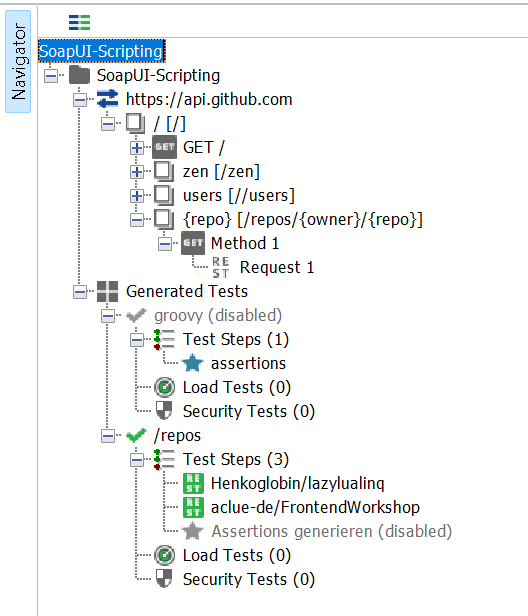

# SoapUI-Scripting mit Groovy

Allein der Name [SoapUI](https://www.soapui.org/) lässt wohl so manchen Entwickler bereits schaudern, schließlich bauen heutzutage die meisten Schnittstellen doch eher auf REST und JSON statt auf [SOAP](https://de.wikipedia.org/wiki/SOAP) und XML auf. In der Tat lässt sich SoapUI ähnlich wie etwa Postman jedoch auch nutzen, um REST-Schnittstellen aufzurufen und zu testen.

Ein großer Vorteil von SoapUI ist seine Erweiterbarkeit durch Groovy-Scripte. Diese können etwa genutzt werden, um Tests zu unterstützen (beispielsweise als Setup- und Teardown-Scripte) oder um das Verhalten von Mocks zu definieren.

In einem unserer Projekte haben wir Groovy-Scripte intensiv genutzt, um automatisiert Testfälle generieren zu können: Da wir bestehende Microservices modernisiert haben, bestand die Anforderung, dass die 'neuen' Services exakt die gleichen Daten liefern sollten wie vor der Modernisierung. Um nun nicht hunderte von Assertions von Hand anlegen zu müssen, haben wir Groovy-Scripte entwickelt, die uns diese Aufgabe abnehmen.

> Solche _Snapshots_ von Schnittstellen-Daten können natürlich auch in allgemeineren Szenarien nützlich sein; auch bei der Weiterentwicklung von Services kann es nützlich sein, zu verifizieren, dass nicht versehentlich andere Felder der Antworten verändert worden sind. Für _veränderliche_ Daten sind Snapshot-Vergleiche selbstverständlich nicht geeignet; sofern nur bestimmte Felder veränderlich sind, können diese über eine Blockliste ausgeschlossen werden.

Dieser Artikel präsentiert eine "abgespeckte" Version des fertigen Scripts, die als Grundlage für weitere Entwicklungen dienen kann. Keine Angst: Wer Erfahrung mit Java oder Kotlin hat, wird sich in Groovy schnell zurechtfinden und hat bereits die richtigen Instinkte.

## Groovy-Scripte anlegen

Leider stellt es sich als etwas umständlich heraus, Code _wiederverwertbar_ in SoapUI Test-Suiten zu hinterlegen. Glücklicherweise gibt es einen [etwas ungewöhnlichen Weg](https://blog.sysco.no/testing/scriptlibrary-in-soapui/#using-shared-library), um Codeteile auszulagern und an anderer Stelle einzubinden.

Wir können somit die gemeinsame Logik für die Erstellung unserer Assertions (oder beliebigen anderen wiederverwendbaren Code) in einem zentralen _Test Step_ anlegen. Als Beispiel legen wir einen _Test Case_ namens `groovy` an, der einen Groovy _Test Step_ namens `assertions` enthält. Den _Test Case_ können wir dabei deaktivieren, da er keine tatsächlichen Tests enthalten wird und nur als Container dient. Der kompletten Quellcode kann am Ende dieses Artikels heruntergeladen werden; wir werden ihn im Laufe des Artikels aber auch gemeinsam entwickeln. Für den Start legen wir hier nur eine Klasse `AssertionUtilities` an und hinterlegen eine Instanz dieser Klasse im `context`-Objekt:

```groovy
import org.apache.logging.log4j.core.Logger
import com.eviware.soapui.model.testsuite.TestCaseRunner

// Diese Imports werden wir später noch benötigen
import com.eviware.soapui.impl.wsdl.teststeps.RestTestRequestStep
import com.eviware.soapui.impl.wsdl.teststeps.PropertyTransfersTestStep
import com.eviware.soapui.impl.wsdl.teststeps.JdbcRequestTestStep

import groovy.json.JsonSlurper
import groovy.json.JsonException

class AssertionUtilities {
	Logger log
	Object context
	TestCaseRunner testRunner
	JsonSlurper jsonSlurper

	def AssertionUtilities(Logger log, Object context, TestCaseRunner testRunner) {
		this.log = log
		this.context = context
		this.testRunner = testRunner

		this.jsonSlurper = new JsonSlurper()
	}

	def createAssertionsForTestCase() {
		log.info("dummy")
	}
}

context.assertions = new AssertionUtilities(log, context, testRunner)
```

> Hinweis: Die JavaDocs zu SoapUI-Klassen sind leider recht unübersichtlich gestaltet, daher ist es häufig hilfreich, sich Details zu Objekten über die `.class` - eventuell unter Zuhilfenahme von Reflection - ausgeben zu lassen. Da der Code-Editor von SoapUI leider auch keine Unterstützung bietet, ist auch die Angabe von Typen wenig hilfreich (und in Groovy ohnehin optional). Ist der Typname bekannt, können die verfügbaren Methoden jedoch in der Regel über die Online-JavaDocs eingesehen werden, beispielsweise für [TestCaseRunner](https://www.soapui.org/apidocs/soapui/DefaultPackage/MockTestRunner.html). Im Rest des Artikels werden wir größtenteils darauf verzichten, Typen zu spezifizieren.

Die tatsächlichen Testfälle können anschließend ebenfalls als _Test Cases_ und _Test Steps_ angelegt werden. Jeder _Test Case_ wird dann einen zusätzlichen (wiederum deaktivierten) Groovy _Test Step_ enthalten, der dafür zuständig ist, die gewünschten Assertions zu generieren. Diese Steps sehen alle sehr ähnlich aus: Sie importieren zunächst den gemeinsam genutzten Code und rufen anschließend nur die Funktion `createAssertionsForTestCase` auf, der wir in späteren Artikeln noch Parameter geben werden, die die genaue Ausgestaltung der Assertions kontrollieren.

Es ist wichtig, den jeweiligen _Test Step_ zu deaktivieren, damit er tatsächlich nur **manuell ausgeführt** werden kann; ansonsten würden die Assertions der anderen _Test Steps_ bei jedem Ausführen der _Test Cases_ neu generiert - im besten Falle kostet dies lediglich etwas Zeit, im schlechtesten Falle können dadurch jedoch Fehler unentdeckt bleiben. Deaktivierte _Test Steps_ werden bei der Ausführung eines kompletten _Test Case_ oder sogar der kompletten _Test Suite_ ignoriert, lassen sich aber über den grünen Pfeil im Script-Editor regulär ausführen.

```groovy
// Library importieren, via https://blog.sysco.no/testing/scriptlibrary-in-soapui/
if(context.assertions == null) {
	testRunner.testCase.testSuite
		.getTestCaseByName("groovy")
		.getTestStepByName("assertions")
		.run(testRunner, context)
}

context.assertions.createAssertionsForTestCase()
```

Die finale Struktur unseres Testprojektes sollte nun in etwa so aussehen; zu beachten sind insbesondere der deaktivierte Testfall `groovy` sowie der deaktivierte Testschritt `Assertions generieren`.



## Testfälle und -schritte ausführen

Zum Start ein kurzer Refresher zur Terminologie: Schnittstellen-Tests bilden in SoapUI eine Baumstruktur bestehend aus folgenden Ebenen:

- Projekt
  - Test Suite
	- Test Case
	  - Test Step

Der _Test Case_ kann dabei theoretisch alles mögliche sein: Ein fachlicher Testfall (etwa ein "Passwort zurücksetzen"-Flow) mit mehreren aufeinander aufbauenden Schritten ist ebenso denkbar wie eine Liste nicht zusammenhängender Tests mit unterschiedlichen Eingabedaten. Ein Test Case kann aus einer beliebigen Kombination von _Test Steps_ bestehen, beispielsweise könnte ein _JDBC Request_ zunächst einen definierten Zustand in einer Datenbank herstellen; ein _REST Request_ führt dann eine Aktion aus, ein _Property Transfer_ überträgt einen Teil der Antwort (etwa eine ID) in einen zweiten _REST Request_ und zum Abschluss wird per _JDBC Request_ wieder der Ausgangszustand wiederhergestellt.

Die Aufgabe unserer Funktion `createAssertionsForTestCase` wird es zunächst sein, alle Steps des übergeordneten _Test Case_ des Groovy-Scripts zu durchlaufen. Wir können an dieser Stelle auf unterschiedliche Arten von _Test Steps_ reagieren, beispielsweise könnten wir eine gesonderte Behandlung von _JDBC Request_- und _Property Transfer_-Steps implementieren oder die Generierung von Assertions für _REST Request_-Steps gegen bestimmte Services (beispielsweise einen Login-Service) unterdrücken. In unserem Fall ist die Logik vergleichsweise einfach: Ist ein _Test Step_ deaktiviert, wird er übersprungen, ansonsten wird er ausgeführt.

Der `TestCaseRunner`, den wir im Konstruktor unserer `AssertionUtilities`-Klasse übergeben haben (und der wiederum vom jeweils ausgeführten _Test Case_ befüllt wird) bietet uns bereits Zugriff auf den aktuellen `TestCase` (über die `testCase`-Property), auf dessen Kind-Elemente (die einzelnen Testschritte für einen Testfall) können wir wiederum per `testStepList`-Property zugreifen.

Auch einen Testschritt auszuführen ist denkbar einfach: Wir rufen die `run`-Methode des Schritts auf und übergeben unseren `TestCaseRunner` und den `context`.

Zum Abschluss prüfen wir, ob es sich beim aktuellen Testschritt um einen `RestTestRequestStep` handelt: Nur dann werden anschließend auch Assertions generiert. 

```groovy
def createAssertionsForTestCase() {
	for(step in testRunner.testCase.testStepList) {
		if(step.disabled) {
			continue
		}

		step.run(testRunner, context)

		// Nur für Rest Request Steps wollen wir Assertions generieren
		if(step instanceof RestTestRequestStep) {
			def response = step.httpRequest.response

			log.info("[${step.label}] Assertions werden erzeugt...")
			createHttpStatusAssertion(step, response.statusCode)
			createContentAssertions(step, response.responseContent)

			log.info("[${step.label}] Assertions erfolgreich erzeugt.")
		}
	}
}

def createContentAssertions(step, responseContent) {
	try {
		def data = jsonSlurper.parseText(responseContent)
		generateAssertionsForValue(step, "\$", data)
	} catch(JsonException e) {
		testRunner.fail("${step.label} hat kein JSON geliefert; fehlt ein Accept-Header?")
		log.info(e.message)
	}
}
```

## Erstellung von Assertions: `step.addAssertion`

Einem Test Step Assertions hinzuzufügen passiert über die Methode `addAssertion`, die gleichzeitig auch als Factory dient: Sie gibt die zu verwendende Instanz der Assertion zurück, die dann konfiguriert werden kann. Ein String-Parameter, der dem Namen der Assertion in der Benutzeroberfläche entspricht (etwa "Valid HTTP Status Codes") gibt dabei an, welche Art von Assertion erzeugt werden soll. Diese API ist zugegebenermaßen gewöhnungsbedürftig, den HTTP-Statuscode zu validieren fällt damit dennoch einfach:

```groovy
def createHttpStatusAssertion(step, statusCode) {
	def name = ":status = $statusCode"

	// Die Namen von Assertions müssen innerhalb eines Testschritts immer eindeutig sein; zudem wollen wir verhindern, dass mehrfache Aufrufe unseres Scripts (etwa, nachdem neue Felder hinzugefügt wurden) Duplikate bestehender Assertions anlegen
	if(step.getAssertionByName(name) == null) {
		log.debug("Erstelle $name")

		def assertion = step.addAssertion("Valid HTTP Status Codes")
		assertion.name = name
		assertion.codes = statusCode
	} else {
		log.info("Überspringe $name, da sie bereits existiert")
	}
}
```

Die Validierung unserer eigentlichen Daten ist allerdings etwas komplizierter. Es wäre natürlich trivial, den Textinhalt der Antwort 1:1 zu vergleichen, jedoch würde hier bereits eine Abweichung in der Formatierung oder der Reihenfolge von Feldern - Dinge, die auf die konsumierenden Services keinen Einfluss haben sollten - dazu führen, dass die Ergebnisse nicht mehr gleich sind. Zudem wäre eine Fehlermeldung im Sinne von "irgendwo im JSON gibt es eine Abweichung" nicht sehr hilfreich. An dieser Stelle können wir uns mit JsonPath-Match-Assertions behelfen: Sie prüfen einen Wert an einer bestimmten Stelle des JSON-Dokuments auf einen vorgegebenen Wert. In unserem Falle werden wir rekursiv die gesamte Antwort durchlaufen und für **jedes** Feld eine Assertion generieren.

> Hinweis: Hier ist Vorsicht geboten, da viele Assertions SoapUI schnell in die Knie zwingen können - die Erzeugung mehrerer tausend Assertions kann schnell mehrere Minuten in Anspruch nehmen. Zudem wächst mit jeder Assertion natürlich auch die SoapUI-Projektdatei. 

## JSON-Felder validieren mit JsonPath Match Assertions

Um nun alle Felder unserer Antwort zu validieren, müssen wir zunächst durch die Antwort iterieren: Für jeden Wert müssen wir zwischen einem JSON-Objekt, einem JSON-Array und 'nativen' Werten (Strings, Booleans, Numbers, null) unterscheiden. Kommen wir bei einem 'nativen' Wert an, generieren wir einen JsonPath und legen eine Assertion an, um den entsprechenden Wert zu überprüfen.

> [JsonPath](https://goessner.net/articles/JsonPath/) definiert den Zugriff auf ein Teildokument in einem größeren JSON-Dokument. Der Artikel von Stefan Gössner gibt einen guten Eindruck von der Syntax von JsonPath. Pfade in JsonPath-Notation sind in der Regel recht selbsterklärend, `$.employees[0].name` beschreibt etwa den 'Pfad' zum Namen des ersten Mitarbeiters in einem JSON-Dokument mit folgendem Aufbau:
> ```json
> {
>   "employees": [
>	   {
>		   "id": 123,
>		   "name": "Max Mustermann"
>	   }
>   ]
> }
> ```

Zunächst prüfen wir den konkreten Typen des aktuellen Werts. Da wir mit einem untypisierten Modell der Daten arbeiten, gibt uns der JsonSlurper für komplexe Werte (Arrays und Objekte) Instanzen von `List` und `Map` zurück. Wir durchlaufen in beiden Fällen die einzelnen Elemente und erzeugen einen "laufenden" Pfad mithilfe der Indexer-Syntax (`$.liste[0]` für Arrays, `$.objekt['key']` für Objekte). Für alle anderen Werte erzeugen wir dann tatsächlich eine _JsonPath Match_-Assertion mit dem bis dorthin gefundenen Pfad.

```groovy
def generateAssertionsForValue(step, path, value) {
	if(value instanceof List) {
		return generateAssertionsForList(step, path, value)
	} else if(value instanceof Map) {
		return generateAssertionsForMap(step, path, value)
	} else {
		return createJsonPathContentAssertion(step, path, value)
	}
}

def generateAssertionsForList(step, path, list) {
	list.eachWithIndex { entry, i ->
		generateAssertionsForValue(step, "$path[$i]", entry)
	}
}

def generateAssertionsForMap(step, path, map) {
	for(entry in map) {
		generateAssertionsForValue(step, "$path['${entry.key}']", entry.value)
	}
}

def createJsonPathContentAssertion(step, path, value) {
	def name = "$path = $value"

	if(step.getAssertionByName(name) == null) {
		log.debug("Erstelle $name")

		def assertion = step.addAssertion("JsonPath Match")
		assertion.name = name
		assertion.path = path
		assertion.expectedContent = value != null ? value : "null"
	} else {
		log.info("Überspringe $name, da sie bereits existiert")
	}
}
```

An dieser Stelle haben wir bereits ein funktionierendes Framework, um unsere Assertions komplett automatisiert zu erzeugen.

## Fazit und Ausblick

Obwohl die API von SoapUI mitunter gewöhnungsbedürftig ist, waren wir dank Groovy in der Lage, mit überschaubarem Aufwand eine solide Grundlage aufzubauen und haben die Grundlagen des Scriptings mit Groovy kennengelernt. 

Im weiteren Verlauf kann es nun hilfreich sein, weitere Features umzusetzen:

- Abweichungen in der Sortierung von Listen erlauben
- Bestimmte Felder vom Vergleich ausschließen
- Neben dem HTTP-Statuscode und dem Inhalt des Body auch Header vergleichen
- Requests automatisiert erst gegen den Referenz- und dann gegen den Test-Endpunkt ausführen
- Helfermethoden definieren, um bestehende Assertions wieder zu löschen/sie komplett neu zu generieren

Diese Features sind mit vergleichbar geringem Aufwand umsetzbar, würden im Rahmen dieses Artikels allerdings zu sehr vom Kern ablenken. Wir werden sie daher in einem späteren Artikel näher beleuchten.

Zum Abschluss können hier ein Testprojekt sowie der Quellcode zur Erzeugung der Assertions in der in diesem Artikel vorgestellten Fassung heruntergeladen werden:

- [Download: SoapUI-Testprojekt](2022-04-07_SoapUI-Scripting/SoapUI-Scripting.xml)
- [Download: assertions.groovy](2022-04-07_SoapUI-Scripting/assertions.groovy)
